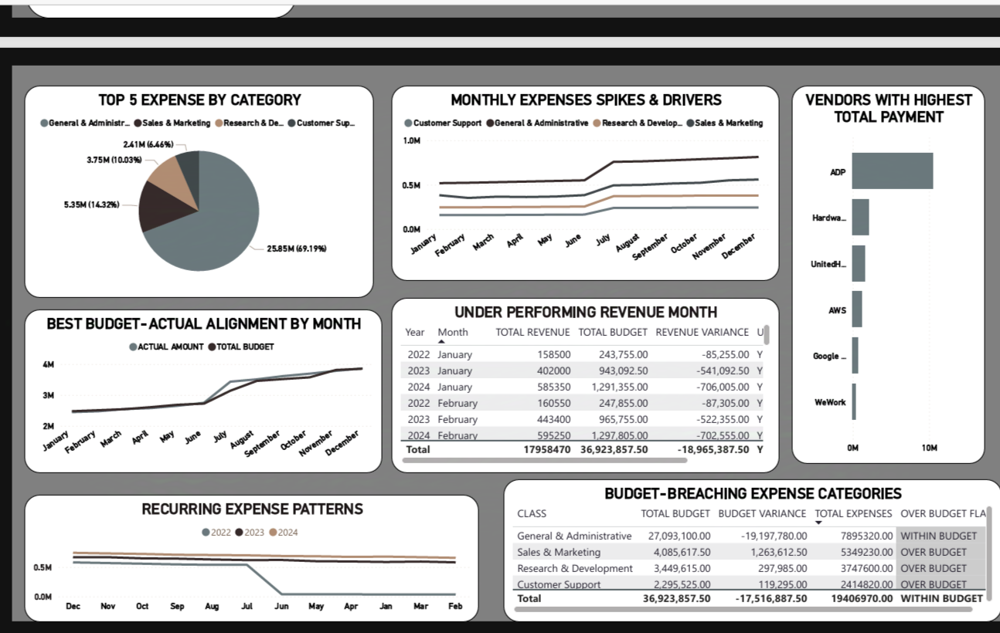
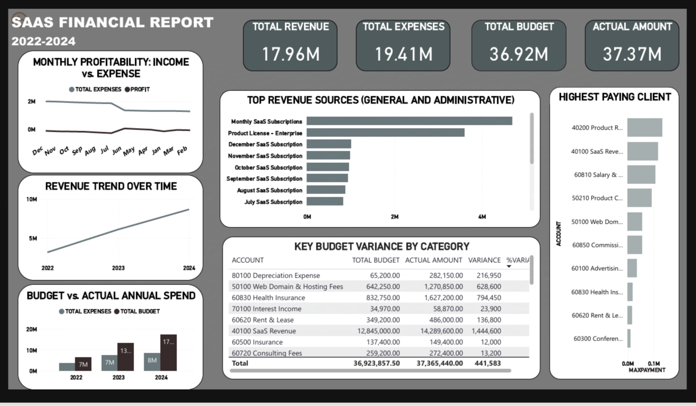
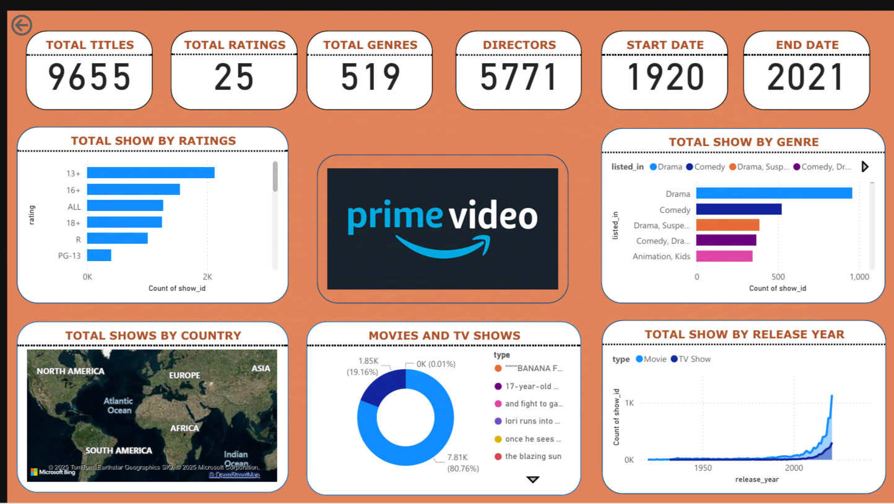

# Data-Portfolio
# Business Intelligence Dashboards – Power BI Portfolio

Welcome to my Business Intelligence portfolio! This repository showcases two interactive dashboards built using Power BI: one focused on **SaaS Financial Reporting** and another analyzing **Prime Video Content**. These dashboards demonstrate skills in data modeling, DAX, dynamic filtering, financial analysis, and UX-focused visualization.

---
(These data used are publicly available )
## 📁 Projects Overview 

### 1. 💼 SaaS Financial Report Dashboard (2022–2024)

**Tool:** Power BI  
**Focus:** Financial Performance, Budget vs. Actuals, Revenue Trends

This dashboard provides a comprehensive financial overview for a SaaS business, covering 3 years of data (2022–2024). It enables CFOs and stakeholders to track monthly profitability, compare actual vs. budgeted spending, and monitor client and vendor contributions.

**🔑 Key Features:**
- 📈 Revenue trend analysis over time (by month/year)
- 💸 Budget vs. Actual Spend with variance tracking
- 👥 Highest paying clients and top revenue-generating products
- 🧾 Top 5 Expense Categories (Admin, Sales, R&D, etc.)
- 🚩 Flagged over-budget departments with breakdown
- 🔍 Recurring expense patterns and spike detection
- 📊 Interactive slicers and filters for drilldowns

**📸 Screenshot Preview:**  

**🔗 [View Power BI File](./dashboards/SaaS_Financial_Report.pbix)**
---

### 2. 🎬 Prime Video Content Analytics Dashboard

**Tool:** Power BI, DAX
**Focus:** Content Catalog Analysis, Genre Distribution, Regional Spread

This dashboard explores Amazon Prime Video’s content library, analyzing over 9,000 titles by genre, ratings, release year, and country. It's tailored for content strategists and acquisition teams who need insights on content trends and gaps.

**🔑 Key Features:**
- 🎭 Content by genre (Drama, Comedy, Suspense, etc.)
- 🌍 Global content map by region/country
- 🎞️ Release year trends and content growth over time
- 📺 TV Show vs. Movie distribution
- 📊 Ratings distribution (13+, 16+, R, etc.)
- 🧩 Interactive filters on type, region, year, and genre

**📸 Screenshot Preview:**  

**🔗 [View Power BI File](./dashboards/Prime_Video_Analytics.pbix)**

## 🔧 Tools & Techniques Used

- **Power BI Desktop**  
- **Data Modeling & Relationships**  
- **DAX Calculations**  
- **Slicers & Filters for Interactivity**  
- **Custom Visuals & Conditional Formatting**  
- **Variance & Trend Analysis**  
- **Map Visuals and Hierarchical Filtering**

  
## ⚠️ Disclaimer

-**This dashboard was developed using publicly available data sourced from the internet.**
-**No proprietary or internal data from any company was used.**
-**All insights, visualizations, and interpretations are purely for demonstration and do not reflect real business performance.** 
_**All names, products, and metrics are fictional or anonymized.**
## 📁 Repository Structure
